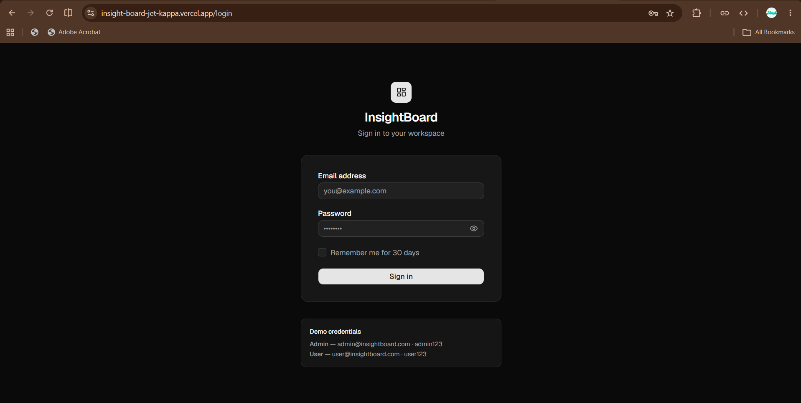
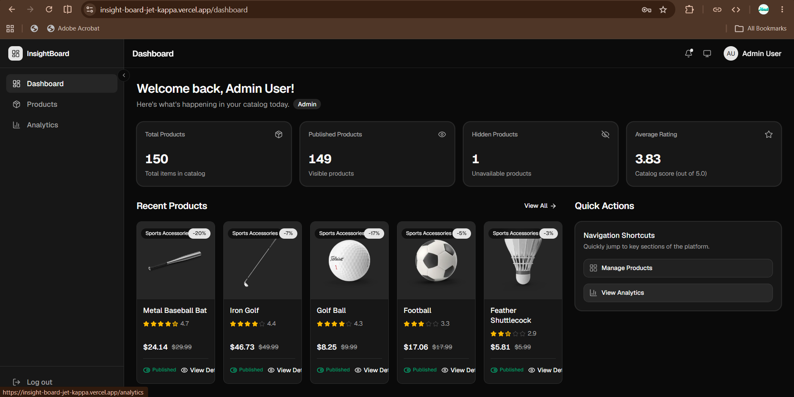
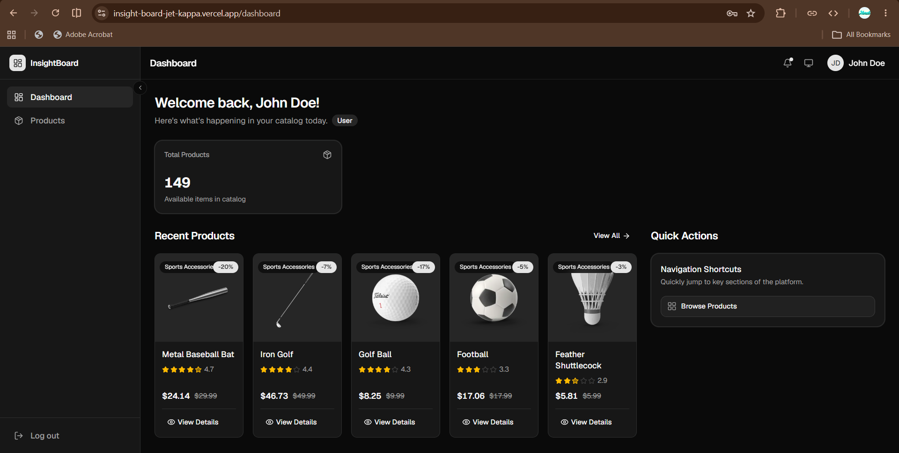
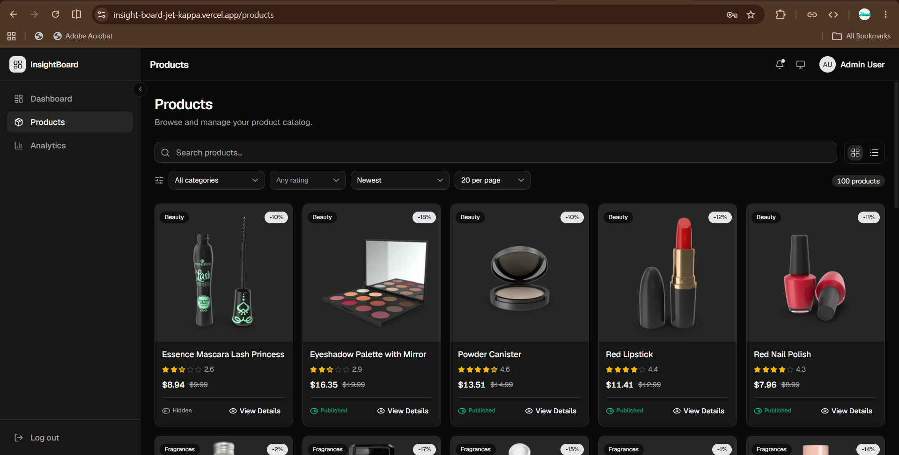
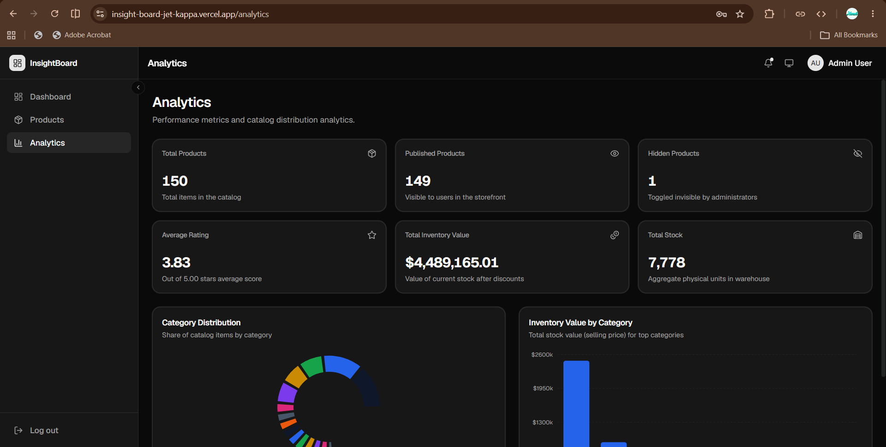

# InsightBoard

A modern SaaS-inspired Product Management Dashboard built with **React**, **Vite**, **Tailwind CSS**, and **shadcn/ui**. The application provides role-based authentication, product management, analytics, and a responsive admin dashboard with a clean and intuitive user experience.

## 🌐 Live Demo

🔗 https://insight-board-jet-kappa.vercel.app

## 📂 GitHub Repository

🔗 https://github.com/harsh-dsk/insight-board

---

# ✨ Features

## 🔐 Authentication & Role-Based Access Control

- Admin Login
- User Login
- Protected Routes
- Persistent Authentication
- Role-Based Access Control (RBAC)

### Admin

- Dashboard
- Product Management
- Analytics Dashboard
- Publish / Hide Products

### User

- Dashboard
- Browse Published Products
- Product Details
- Restricted Analytics Access

---

# 📦 Product Management

- Responsive Product Grid
- Responsive Product Table
- Product Details Page
- Image Carousel
- Search Products
- Multi-Category Filtering
- Rating Filter
- Sorting by:
  - Price
  - Rating
  - Name
- Pagination
- URL State Synchronization

---

# 📊 Analytics Dashboard

- Total Products
- Published Products
- Hidden Products
- Average Rating
- Total Inventory Value
- Category Distribution Chart
- Inventory by Category Chart

---

# 📈 Dashboard

### Admin Dashboard

- Welcome Section
- KPI Cards
- Recent Products
- Quick Actions

### User Dashboard

- Welcome Section
- Product Summary
- Recent Products
- Browse Products Shortcut

---

# ⚡ Performance Optimizations

- Debounced Search
- React.memo
- useMemo
- useCallback
- Lazy Loading
- Code Splitting

---

# 🎨 UI/UX Features

- Responsive Layout
- Fixed Sidebar
- Sticky Navbar
- Loading Skeletons
- Empty States
- Error States with Retry
- Dark / Light Theme
- Modern SaaS Design

---

# 🛠 Tech Stack

- React
- Vite
- React Router
- Tailwind CSS
- shadcn/ui
- Axios
- Recharts
- Lucide React
- DummyJSON API

---

# 🔗 API Used

DummyJSON Products API

https://dummyjson.com/products

---

# 👤 Demo Credentials

## Admin

**Email**

```
admin@insightboard.com
```

**Password**

```
admin123
```

---

## User

**Email**

```
user@insightboard.com
```

**Password**

```
user123
```

---

# 🚀 Installation

Clone the repository

```bash
git clone https://github.com/harsh-dsk/insight-board.git
```

Navigate to the project

```bash
cd insight-board
```

Install dependencies

```bash
npm install
```

Run development server

```bash
npm run dev
```

Build production

```bash
npm run build
```

Preview production build

```bash
npm run preview
```

---

# 📁 Project Structure

```
src
│
├── assets
├── components
│   ├── analytics
│   ├── common
│   ├── dashboard
│   ├── layout
│   ├── products
│   └── ui
│
├── constants
├── context
├── hooks
├── layouts
├── pages
├── routes
├── services
├── utils
└── main.jsx
```

---

# ✅ Assignment Requirements Covered

- Responsive Dashboard Layout
- Sidebar Navigation
- Top Navigation Bar
- User Profile Section
- Product Listing Module
- Product Detail Page
- Analytics Dashboard
- Search Functionality
- Multi-Category Filtering
- Sorting
- Pagination
- URL State Synchronization
- Authentication
- Role-Based Access Control
- Performance Optimizations

---

---

# 📸 Screenshots

## 🔐 Login



---

## 👨‍💼 Admin Dashboard



---

## 👤 User Dashboard



---

## 📦 Products



---

## 📈 Analytics Dashboard



---

# 👨‍💻 Author

**Harshdeep Singh**

GitHub: https://github.com/harsh-dsk

LinkedIn: https://www.linkedin.com/in/harshdeep-singh-khanuja-507700326/

---

## ⭐ If you found this project useful, consider giving it a star!
